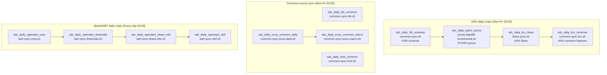

# SDC production deployment

이 디렉터리는 `sj2-server:/home/whi/apps/sdc`에 배포되는 SDC 운영 파일의 source of truth다.

- 마지막 확인: **2026-09-21 KST** (`us-derive` 추가 · v0.15.1)
- 확인한 원천: Cronicle API `GET /api/app/get_schedule/v1`, `GET /api/app/get_event/v1`, 원격 파일 `whi@sj2-server:/home/whi/apps/sdc/{compose.yaml,bin/}`
- Cronicle UI: `http://sj2-server:3012/#Schedule`
- 배포 경로: `whi@sj2-server:/home/whi/apps/sdc`
- 현재 compose image: **`ghcr.io/sjleekor/collector:v0.15.1`** (2026-09-21 기준 원격과 이 저장소가 같다)
- 현재 상시 기동 서비스: `db`만 기동. `collector`는 Cronicle wrapper가 `docker compose run --rm collector ...`로 작업마다 실행한다.
- **2026-09-21에 `us-derive.sh`를 더했다.** raw→derived를 굳히는 자리가 없었다 — 아래 이벤트 표의 `sdc_daily_us_derive` 행. **`v0.15.1`로 릴리즈·배포·Cronicle 등록까지 끝냈다.** 첫 실행에서 `prices_daily`가 2026-09-09 → **2026-09-18**로 따라잡았다 (+87,693행).
- **2026-09-20부터 미국 수집도 여기서 돈다** (미국 계획 D18). 이벤트 `sdc_daily_us`, 래퍼 `bin/us-daily.sh`, 볼륨 `/home/whi/data/stock_data:/stock_data`.
  이미지에 **`dolt` 2.3.5**가 들어갔다 (1.32GB → 1.43GB) — 미국 가격·IV/HV 원천이다.
- **`us-nasdaq-analyst.sh`를 더했다 (2026-09-24, `v0.15.11`).** Nasdaq 애널리스트 추정치(`analyst/{symbol}/earnings-forecast`) 주 1회 전진 축적 — 아래 "`sdc_daily_us_nasdaq_analyst`" 절 참고. **같은 날 `v0.15.11` 배포 뒤 Cronicle에 등록했다.**

원격 `compose.yaml`과 `bin/*.sh` checksum은 현재 로컬 `deploy/prod`와 일치한다.

> 리팩터 메모(2026-07): sj2는 raw 수집 전용이다. `sdc_daily_common_build`,
> `sdc_daily_common_coverage`, `sdc_daily_common_readiness`, `sdc_daily_metrics_normalize`
> 이벤트는 P4에서 Cronicle에서 제거됐다. 파생 metric/common marts와 readiness는 compute
> 노드에서 `bin/parquet-compute-all.sh`로 실행한다.

## 배포 방법

운영 파일은 서버에서 직접 수정하지 않는다. 이 디렉터리를 수정한 뒤 아래 스크립트로 반영한다.

```bash
./deploy/deploy_to_sj2.sh
```

이 스크립트는 `deploy/prod/compose.yaml`과 `deploy/prod/bin/`을 `sj2-server:/home/whi/apps/sdc`로 `rsync --delete`한다.

> ### ⚠ 배포 전에 이미지 태그를 반드시 맞춘다
>
> **릴리즈 스크립트(`sdc-release`)는 원격 `compose.yaml`만 갱신하고 이 저장소의 파일은
> 건드리지 않았다.** 그래서 릴리즈를 할수록 둘이 벌어지고, **문서대로
> `deploy_to_sj2.sh`를 돌리면 prod가 조용히 롤백된다** — 에러도 안 난다.
>
> 실제로 v0.9.3 릴리즈 시점에 원격은 `v0.9.3`, 저장소는 `v0.8.16`이었다.
> **네 개 릴리즈만큼 뒤처져 있었고 아무것도 그 사실을 보고하지 않았다.**
>
> ```bash
> # 배포 전 확인 — 두 값이 같아야 한다
> grep 'image: ghcr' deploy/prod/compose.yaml
> ssh whi@sj2-server 'grep "image: ghcr" /home/whi/apps/sdc/compose.yaml'
> ```
>
> 로컬 스킬 스크립트에는 저장소 파일도 같이 갱신하도록 고쳐뒀지만, `.agents/`와
> `.claude/`가 `.gitignore`에 있어 **그 수정은 공유되지 않는다.**
> 다른 사람의 환경에서는 여전히 원격만 갱신되므로 위 확인을 거른 채 배포하면 안 된다.

## Cronicle event chain

2026-08-28 Cronicle API 기준 event는 19개다. 정기 event 16개와 수동 one-time event 3개가
있으며 모두 `enabled=1`, `plugin=shellplug`, `category=general`, `target=maingrp`,
`timezone=Asia/Seoul`, `max_children=1`, `multiplex=0`, `catch_up=0`이다. `chain_error`는
모두 비어 있으므로 실패 시 별도 실패 분기로 가지 않고 그 지점에서 chain이 멈춘다.



시간대별로 보면 아래와 같다.

```text
04:00 daily     OpenDART Corp -> Financials -> Share Info -> XBRL
18:30 Mon-Fri  FDR Universe -> PYKRX Prices -> KRX Flows -> KRX Common
19:00 Mon-Fri  KIS Foreign Holding
20:00 Mon-Fri  KRX Open API Market Cap (최근 30일 gap scan, 원천 T+1)
20:30 Mon-Fri  FDR Common, FRED Common, ECOS Daily -> ECOS Macro
20:30 Monday    KIS Investor/Shorting
23:00 daily     Raw Freshness Gate
```

`common_build`/coverage/readiness와 `metrics_normalize`는 더 이상 sj2 compute 책임이 아니다. raw 미러/export 후 compute 노드에서 Parquet/DuckDB 게이트를 실행한다.

## Event 목록

| Event id | Trigger | Chain next | Wrapper | 설명 |
|---|---:|---|---|---|
| `sdc_daily_fdr_universe` | Mon-Fri 18:30 | `sdc_daily_pykrx_prices` | `universe-sync.sh` | FDR 기준 KOSPI/KOSDAQ universe를 동기화한다. |
| `sdc_daily_pykrx_prices` | chain-only | `sdc_daily_krx_flows` | `prices-backfill-incremental.sh` | 전체 시장 일봉 가격을 증분 backfill한다. 기본 lookback은 0일, 자동 range guard는 10일이다. |
| `sdc_daily_krx_flows` | chain-only | `sdc_daily_krx_common` | `flows-sync.sh` | 가격 최신일을 기준으로 KRX 수급 데이터를 증분 동기화한다. 기본 lookback은 14일, 자동 range guard는 30일이다. |
| `sdc_daily_krx_common` | chain-only | 없음 | `common-sync-krx.sh` | KRX 계열 common feature raw series를 증분 동기화한다. 현재는 `krx_flows` 성공 후에만 실행된다. |
| `sdc_kis_flows_trial` | Mon-Fri 19:00 | 없음 | `flows-sync-kis.sh` | KIS `foreign_holding`을 전 종목 동기화한다. |
| `sdc_daily_market_cap` | Mon-Fri 20:00 | 없음 | `prices-market-cap-backfill.sh` | 최근 30일의 `daily_market_cap` gap을 확인하고 T+1 원천의 빠진 세션을 채운다. |
| `sdc_daily_fdr_common` | Mon-Fri 20:30 | 없음 | `common-sync-fdr.sh` | FDR common feature raw series를 증분 동기화한다. |
| `sdc_daily_fred_common` | Mon-Fri 20:30 | 없음 | `common-sync-fred.sh` | FRED common feature raw series를 증분 동기화한다. |
| `sdc_daily_ecos_common_daily` | Mon-Fri 20:30 | `sdc_daily_ecos_common_macro` | `common-sync-ecos-daily.sh` | ECOS 일간 common feature raw series를 증분 동기화한다. |
| `sdc_daily_ecos_common_macro` | chain-only | 없음 | `common-sync-ecos-macro.sh` | ECOS 월간 macro series(`macro_cpi`, `macro_ppi`, `macro_m2`, `macro_consumer_sentiment`)를 긴 lookback으로 동기화한다. |
| `sdc_kis_flows_weekly` | Monday 20:30 | 없음 | `flows-sync-kis.sh` | KIS investor/shorting 지표를 주 1회 동기화한다. |
| `sdc_daily_freshness` | daily 23:00 | 없음 | `ops-freshness-report.sh` | 저녁 수집이 끝난 뒤 raw 최신일을 검사하고 stale이면 실패한다. |
| `sdc_daily_opendart_corp` | daily 04:00 | `sdc_daily_opendart_financials` | `dart-sync-corp.sh` | OpenDART corp master를 동기화한다. |
| `sdc_daily_opendart_financials` | chain-only | `sdc_daily_opendart_share_info` | `dart-sync-financials.sh` | OpenDART 재무제표를 증분 동기화한다. 기본 lookback은 1년, attempt guard는 10,000건이다. |
| `sdc_daily_opendart_share_info` | chain-only | `sdc_daily_opendart_xbrl` | `dart-sync-share-info.sh` | 주식수, 배당, 자기주식 관련 OpenDART 데이터를 증분 동기화한다. Cronicle script에 `DART_SHARE_INFO_MAX_ATTEMPT_TARGETS=35000` override가 있다. |
| `sdc_daily_opendart_xbrl` | chain-only | 없음 | `dart-sync-xbrl.sh` | OpenDART XBRL 데이터를 증분 동기화한다. 기본 attempt guard는 10,000건이다. |
| **`sdc_daily_us`** | **daily 15:00** | 없음 | **`us-daily.sh`** | **미국 raw를 하루치 받는다** (미국 계획 C8). 원천 여덟(dolt·Nasdaq 실적·FINRA regsho·FINRA 잔고·SEC 벌크·SEC 분기·**SEC FTD**·FRED/Wikipedia)을 한 명령이 순서대로 본다. **평일이 아니라 매일이다** — 할 일을 일정이 아니라 `raw/`에 무엇이 있나로 만들어서 주말 실행이 거의 공짜고, 주 1회짜리 SEC 벌크 3GB에 조용한 슬롯을 준다. `catch_up=0`인 이유도 같다: 잡 자체가 마지막으로 받은 것부터 어제까지 메꾼다. **SEC FTD**(2026-09-24 추가)는 반월 파일이라 URL을 규칙으로 못 만들어 목록 페이지를 매번 다시 읽는다 — 새 원천 요청은 반월당 하나뿐이다(`collector/src/collector/us/sources/sec_ftd.py`). |
| **`sdc_daily_us_derive`** | **Sunday 16:00** | 없음 | **`us-derive.sh`** | **미국 raw를 derived 스냅샷으로 굳힌다** (미국 계획 05 §4.1). **2026-09-21 등록. `catch_up=0`·`max_children=1`.** `sdc_daily_us`는 raw만 받아서 `dolt pull`은 매일 도는데 `prices_daily` 스냅샷이 2026-09-09에 멈춰 있었다. **무엇을 굳힐지는 일정이 아니라 입력이 정한다** — dolt는 커밋 해시, 나머지는 `raw/` mtime을 스냅샷과 비교한다. 그래서 주 1회로 걸어도 분기짜리 SEC 표는 분기에 한 번만 쌓인다. 회당 약 1.5GB다. 락 도메인이 `us`라 15:00 수집과 겹치지 않는다. **유니버스는 여기 없다** — 월 1회라 `us-universe rebuild`가 따로 한다 (03 §5.3). **2026-09-24부터 `ftd_fails`·`cusip_symbol_pit`도 여기서 굳는다** — `us-load ftd`와 같은 recipe(`RECIPES["ftd"]`)를 쓴다. `SDC_US_DERIVE_TABLES` override가 `.env`에 없으므로(2026-09-24 확인) 별도 설정 없이 자동으로 포함된다. |
| **`sdc_daily_us_nasdaq_analyst`** | **Saturday 09:00** | 없음 | **`us-nasdaq-analyst.sh`** | **Nasdaq 애널리스트 추정치를 주 1회 전진 축적한다** (source_expansion 04·99 순번 4). **2026-09-24 등록. `catch_up=0`·`max_children=1`.** 아래 절 참고. |

### `sdc_daily_us_nasdaq_analyst` (2026-09-24 등록)

**2026-09-24에 `create_event`로 등록했다** (`v0.15.11` 배포 직후). 첫 실행은 같은 날
`run_event`로 손으로 걸었다. 아래가 등록한 값이다.

| 항목 | 등록 값 | 이유 |
|---|---|---|
| Event id | `sdc_daily_us_nasdaq_analyst` | `sdc_daily_us_derive`처럼 실제로는 주 1회지만 기존 명명(`sdc_daily_*`)을 따른다 |
| Timing | **Saturday 09:00 KST** | 한국 체인(Mon-Fri 18:30)·`sdc_daily_us`(매일 15:00)·`sdc_daily_us_derive`(일 16:00) 어느 것과도 겹치지 않는다. 토요일 09:00에 시작하면 예산(8.5시간)을 다 써도 17:30에 끝나 일요일 16:00 derive에 그 주 데이터가 들어간다. 15:00 `sdc_daily_us`와 겹치지만 락 도메인도 원천 호스트도 다르다 |
| Wrapper | `bin/us-nasdaq-analyst.sh` | `us-nasdaq-analyst run --budget-seconds "$SDC_US_NASDAQ_ANALYST_BUDGET_SECONDS"` (기본 30600=8.5시간. 처음 6시간은 첫 실행에서 모자랐다 — 아래) |
| Lock domain | **`us_nasdaq_analyst` (자기 도메인, `us`와 다르다)** | 종목당 1요청이라 전체를 돌면 몇 시간이 걸린다(04 §4). `us` 도메인을 같이 쓰면 그동안 `sdc_daily_us`(15:00)·`sdc_daily_us_derive`가 lock 대기에서 막힌다. 건드리는 raw 하위 트리(`raw/nasdaq/analyst_earnings_forecast/`)도 겹치지 않아 같은 도메인일 이유가 없다 |
| `catch_up` | `0` | 다른 미국 event와 같다. 잡 자체가 "이번 주 유니버스 중 아직 못 받은 심볼"로 할 일을 정하므로 놓친 주가 있어도 다음 실행이 자연히 이어받는다 |
| `max_children` | `1` | 다른 미국 event와 같다 |

**남은 문제 — 예산을 넘기면 다음 주까지 기다린다.** `us-daily`/`us-derive`는
매일 도는 래퍼가 내부에서 "주 1회면 충분"을 판단하므로 예산을 못 채워도 다음 날
이어받는다. 이 잡은 **주 1회 트리거 자체**라서, 한 번의 실행이 예산 안에 유니버스
전체를 못 끝내면 나머지는 **다음 토요일**까지 `pending`으로 남는다 — 그리고 다음
토요일은 새 ISO 주 파티션이라 **그 주 몫은 영영 안 채워진다.** 순서가 알파벳이라
**매주 같은 뒤쪽 종목이 빠진다.** 처음에는 6시간 예산으로 끝날 것으로 봤는데
**첫 실행(2026-09-24)에서 틀렸다** — 유니버스 4,081종목 · 실측 종목당 약 6초라
한 바퀴가 약 6.8시간이다. 그래서 기본 예산을 8.5시간으로 올렸다.
운영자가 `pending > 0`을 job 출력에서 보면 같은 주 안에 손으로 다시 돌려도
안전하다(이미 받은 심볼은 건너뛴다) — 필요하면 나중에 수요일 등에 가벼운 catch-up
트리거를 하나 더 추가하는 것도 고려할 수 있다.

## Wrapper와 lock/throttle

대부분의 daily wrapper는 `bin/lib/sdc-wrapper.sh`를 source하고 `docker compose run --rm collector ...`를 호출한다. wrapper의 주요 실행 함수는 아래와 같다.

- `sdc_run_collector`: source lock 없이 collector command를 실행한다.
- `sdc_run_daily_collector <domain> ...`: host-side source lock을 잡고 실행한다. **기본이 ON**이며 `SDC_DAILY_USE_SOURCE_LOCK=0`으로만 끌 수 있다.
- `sdc_run_collector_with_lock <domain> ...`: 항상 source lock을 잡고 실행한다. manual backfill wrapper에서 주로 쓴다.

> **2026-08-15 변경.** `sdc_run_daily_collector`의 락은 원래 opt-in(`=1`일 때만)이었고,
> **prod은 켠 적이 없었다** — `.env`에도, 호스트 env에도, Cronicle 이벤트 스크립트에도 없었고
> `/tmp/sdc-locks` 자체가 존재하지 않았다. 락을 잡는 것처럼 읽히는 wrapper 7개가 실제로는
> 아무것도 잡고 있지 않았다는 뜻이다. 기본값을 ON으로 뒤집었다. 스케줄 시간대 분리는
> 대체재가 아니다 — 창을 넘기는 run(flows 실측 775s, 백필은 구조적으로 수 시간)이
> 조용히 동시 실행을 되살린다.

source lock은 `/tmp/sdc-locks/<domain>.lock`에 `flock`을 걸고, lock 획득 직후 `/tmp/sdc-throttle/<domain>.last`를 이용해 source별 최소 간격을 둔다. lock conflict 기본 mode는 `fail`이며 conflict 시 exit code 75를 반환한다.

| Domain | 주로 쓰는 wrapper | 기본 throttle |
|---|---|---:|
| `fdr` | `universe-sync.sh`, `common-sync-fdr.sh` | 10s |
| `fred` | `common-sync-fred.sh` | 10s |
| `ecos` | `common-sync-ecos-daily.sh`, `common-sync-ecos-macro.sh` | 10s |
| `krx_marketdata` | `prices-backfill-incremental.sh`, `flows-sync.sh`, `common-sync-krx.sh`, `common-sync-pykrx.sh` | 60s |
| `opendart` | OpenDART sync wrappers, OpenDART backfill | 5s |
| **`us`** | **`us-daily.sh`** | **0s** — 원천별 간격은 각 클라이언트 안에 있다 (SEC 5s · FINRA·Wikipedia·FRED 1s · Nasdaq 1.5s) |
| **`us_nasdaq_analyst`** | **`us-nasdaq-analyst.sh`** | **0s** — 종목당 간격(기본 5초)이 Python 클라이언트 안에 있다. `us`와 다른 도메인을 쓰는 이유는 위 "`sdc_daily_us_nasdaq_analyst`" 절 참고 |

### KRX 요청 페이스 (2026-08-16 정정)

**`data.krx.co.kr`을 때리는 모든 수집기는 하나의 정책을 쓴다.** 어떤 라이브러리를
경유하든 상대는 같은 포털이다.

| 설정 | 기본값 | 의미 |
|---|---:|---|
| `KRX_MIN_DELAY_SECONDS` / `KRX_MAX_DELAY_SECONDS` | 1.5 / 4.0 | 요청 간격(랜덤) |
| `KRX_LONG_REST_EVERY` | 15 | 롱 레스트 주기 |
| `KRX_LONG_REST_MIN_SECONDS` / `_MAX_` | 30 / 90 | 롱 레스트 길이 |
| `KRX_ERROR_BACKOFF_MIN_SECONDS` / `_MAX_` | 45 / 180 | **에러 후 백오프** |
| `KRX_AUTH_COOLDOWN_SECONDS` | 10 | 로그인 후 쿨다운 |

이전에는 pykrx 계열(`prices market-cap-backfill`, `universe backfill-snapshots`)만
따로 `--rate-limit-seconds`로 **0.1~0.4초**를 썼고 **에러 백오프가 아예 없었다.**
같은 호스트에 두 개의 페이스가 있었던 셈이고, 2026-08-16에 KRX가
`자동화 수단을 통한 비정상 대량 조회`로 이 호스트의 IP를 제한했다.

두 명령의 per-run override는 `--min-delay-seconds` / `--max-delay-seconds`뿐이다.
나머지는 위 설정을 따른다. 래퍼는 더 이상 페이스를 고정하지 않는다.

> `prices backfill`은 해당 없다. `adjusted=True`라 pykrx가 KRX가 아니라 **naver**로 간다.

#### 그런데 이걸로 풀리지 않았다 (같은 날 확인)

페이스를 통일한 뒤 **0.32 req/s**(직전의 1/3)로 재개했는데 **95요청 만에 다시 차단**됐다.
1차 차단은 9시간 만에 풀렸으나 재차단은 5분 만에 왔다.

**차단 사유가 속도가 아니다.** KRX Data Marketplace 약관 제10조 제2호는
자동화 수단에 의한 수집 자체를 금지한다 — 속도 조건이 붙어 있지 않다.
**위 설정은 남아 있는 KRX 수집기(`flows sync`, `common sync --sources krx`)의
최소 예의일 뿐, 차단에 대한 해결책이 아니다.**

해결은 공식 경로(KRX Open API)로 옮기는 것이다.
`docs/operations.md` "KRX 접근 제한" 절과
`docs/dev/20260731_raw_features/02_data_expansion_plan/poc/krx_open_api.md` 참고.

주의할 점:

- Cronicle event definition 자체에는 `env` 필드가 없다. event script에 직접 들어간 override는 현재 `sdc_daily_opendart_share_info`의 `DART_SHARE_INFO_MAX_ATTEMPT_TARGETS=35000`뿐이다.
- `SDC_DAILY_USE_SOURCE_LOCK`, `SDC_LOCK_WAIT_SECONDS` 같은 host-side 실행 환경값은 Cronicle process 환경까지 함께 확인해야 한다.
- 최근 KRX job log에서는 `krx_marketdata` lock 대기와 exit 75가 관찰됐다. exit 75는 같은 source domain 작업이 이미 lock을 잡고 있어 대기 시간 안에 시작하지 못했다는 뜻이다.

## 배포되어 있지만 Cronicle event가 아닌 wrapper

아래 파일은 `deploy/prod/bin/`에 배포되지만 현재 Cronicle schedule에는 등록되어 있지 않다.

| Wrapper | 용도 |
|---|---|
| `common-features-refresh.sh` | common catalog seed와 source sync만 수행하는 raw refresh wrapper. 파생 mart/readiness는 compute 노드에서 실행한다. |
| `common-seed-catalog.sh` | common feature catalog schema/data 초기화. |
| `common-sync-pykrx.sh` | PYKRX common source 동기화. 현재 운영 필수 source에는 포함되지 않고 Cronicle event도 없다. |
| `dart-backfill-all-years.sh` | OpenDART 연도별 대량 backfill. 기본은 전체 backfill 구간을 `opendart` lock으로 감싼다. |
| `flows-backfill-range.sh` | `FLOW_START`, `FLOW_END`로 지정한 수급 range를 수동 backfill한다. 항상 `krx_marketdata` lock을 사용한다. |
| `db-init.sh` | collector의 `db init` 실행. |
| `pull-image.sh` | collector image pull. |
| `up-db.sh` | DB service 기동. |
| `validate.sh` | `validate --market all` 실행. |

`flows-sync.sh.bak.20260425_2352`는 배포 디렉터리에 남아 있는 backup 파일이며 Cronicle event에서 호출하지 않는다.

## 현재 schedule에서 특히 헷갈리기 쉬운 점

- `sdc_daily_krx_common`은 현재 독립 21:30 schedule이 아니다. 2026-06-16 23:00:17 KST에 `sdc_daily_krx_flows -> sdc_daily_krx_common` chain으로 변경됐다. 그 이전 history에는 21:30 독립 실행 기록이 남아 있을 수 있다.
- `sdc_daily_opendart_share_info`는 2026-06-15 22:48:40 KST에 Cronicle script override로 `DART_SHARE_INFO_MAX_ATTEMPT_TARGETS=35000`이 들어갔다. wrapper 기본값은 10,000이므로 backlog 해소 후 계속 필요한지 재검토해야 한다.
- 모든 event는 `catch_up=0`이다. Cronicle이 꺼져 있거나 schedule 시각을 놓친 경우 자동 catch-up 실행을 기대하면 안 된다.

## 운영 점검 명령

Cronicle API key는 repo 밖의 secret 파일에서 읽고, 값 자체를 출력하거나 문서에 붙이지 않는다.

```bash
APIKEY=$(awk '$1=="APIKEY:" {print $2}' /Users/whishaw/wss_p/stock_data_collector_secrets/cronicle_info)

# 현재 schedule
curl -fsS -H "X-API-Key: $APIKEY" \
  'http://sj2-server:3012/api/app/get_schedule/v1' | jq '.rows[] | {id,title,enabled,timing,chain,modified}'

# 특정 event 최근 history
curl -fsS -H "X-API-Key: $APIKEY" \
  'http://sj2-server:3012/api/app/get_event_history/v1?id=sdc_daily_common_build&limit=5' | jq '.rows[] | {id,time_start,elapsed,code,description}'

# 특정 job log. Cronicle log API는 gzip 본문을 줄 수 있어 --compressed를 붙인다.
curl --compressed -fsS -H "X-API-Key: $APIKEY" \
  'http://sj2-server:3012/api/app/get_job_log/v1?id=<job-id>&format=text'

# 운영 compose 상태
ssh whi@sj2-server 'cd /home/whi/apps/sdc && docker compose ps'

# 운영 wrapper 확인
ssh whi@sj2-server 'cd /home/whi/apps/sdc/bin && find . -type f | sort'
```
